### Auteur: CAMARA Laby Damaro

### github: https://github.com/camara94

### site: https://stardevcgroup.com/

# Push Notification Flutter Firebase

Dans ce tutoriel, nous allons réaliser une application mobile en flutter qui va recevoir des notification venant de Firebase cloud messaging, nous allons également utiliser des outils comme **Postman** et **curl** pour notifier l'application.


## Comment Créer un Projet Flutter avec package Personnaliser

`flutter create --org com.stardevcgroup push_notification `

* **package: ** com.stardevcgroup 
* **nom du projet: ** push_notification

## Les Dépendances Utilisées dans le Projet

Pour ajouter des dépendance, on va le fichier **pubspec.yml** puis dans la section **dependencies**, on les ajoute.

* *firebase_core: ^1.10.0*
* *provider: ^6.0.1*

* *font_awesome_flutter: ^9.0.0*

* *fluttertoast: ^8.0.8*

* *firebase_auth: ^3.2.0*

* *firebase_messaging: ^11.1.0*

* *flutter_local_notifications: ^9.1.4*

## Création et Configuration d'un Projet Firebase

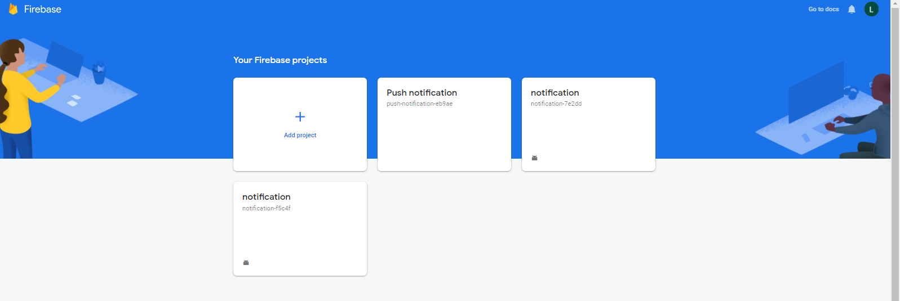

On donne un mon au choix à notre projet Firebase puis  cliquez sur **Continue**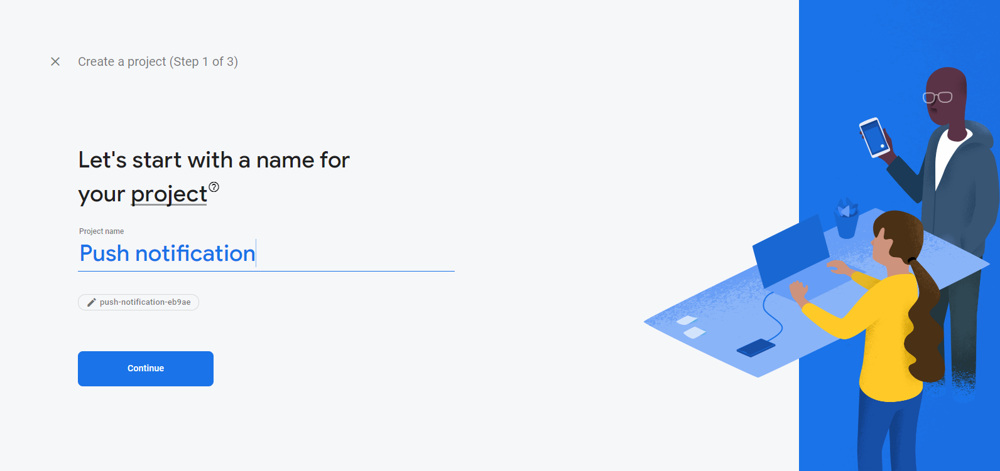

encore **Continue**


En suite on selectionne **Google Analytique**

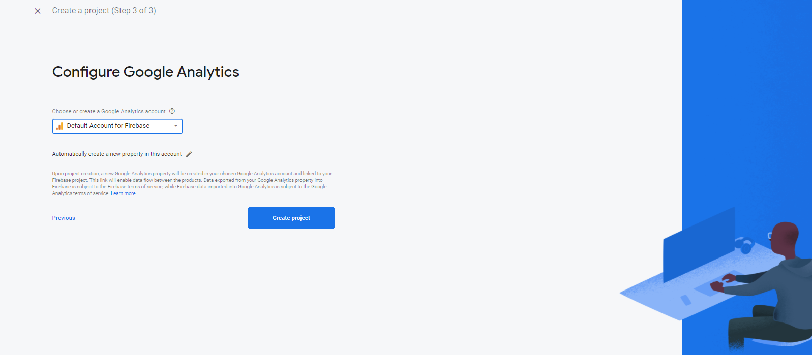


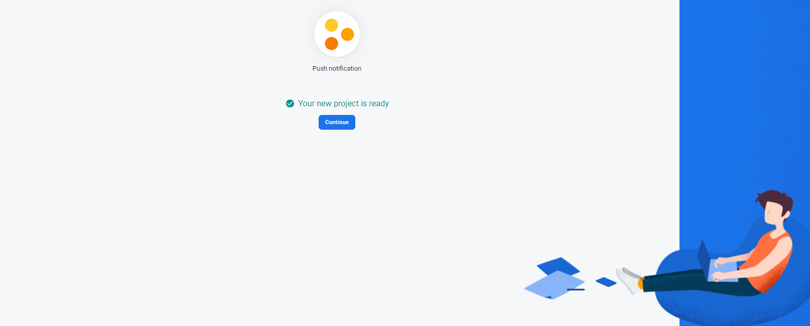


On a trois types de projets:

* **IOS: ** pour les projet les applications **IOS**
* **Android: ** pour les applications **Android**
* **Web: ** pour les applications **Web**

Puis que je travaille sur une application **Android**, alors je sélectionne le projet **Android**

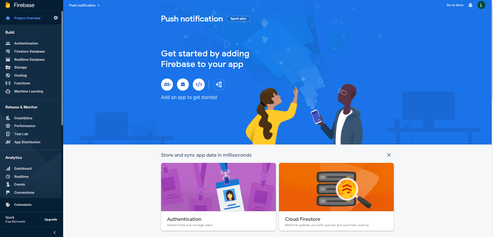


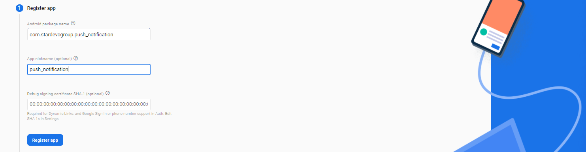

On se rend sur le site  [https://developers.google.com/android/guides/client-auth](https://developers.google.com/android/guides/client-auth) pour générer une SH1 ou SH256 en fonctionne de notre système d'exploitation.

Par exemple moi je suis sous Windows donc je prend cette ligne de commande, je colle dans mon **CMD** pour avoir le **SHA1** et **SHA256**

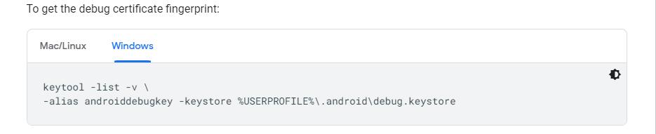

Voici le résultat de cette commande:

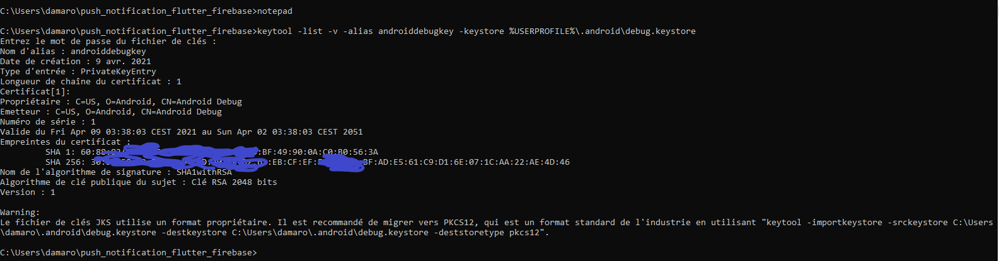


Je colle le **SHA1** ci-dessous:

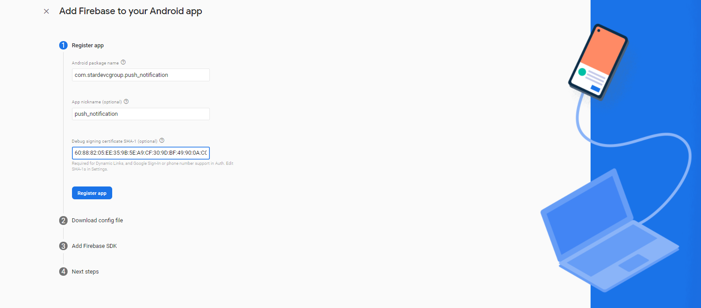

Puis je copie le fichier **JSON**

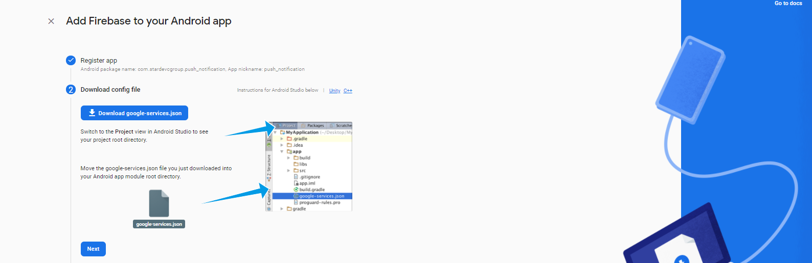

Je le colle dans le projet **app** de mon projet  **Android**

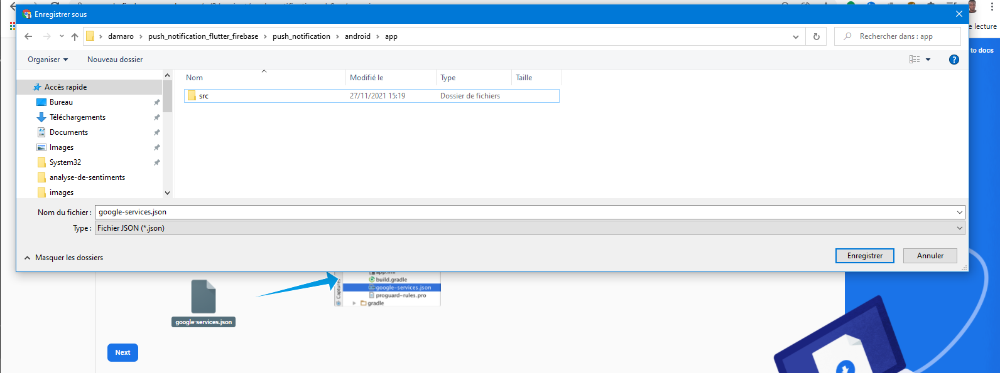


Puis je copie et colle la première ligne cocher dans le fichier **build.gradle** qui se trouve directement dans le dossier **Android**

en suite les autres dans le fichier **build.gradle** qui se trouve dans le dossier **Android/app**

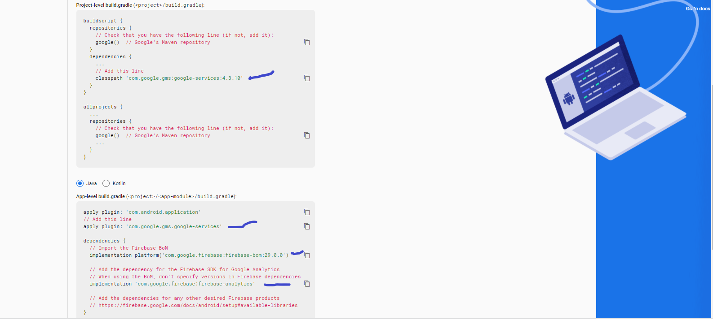

Puis c'est terminé

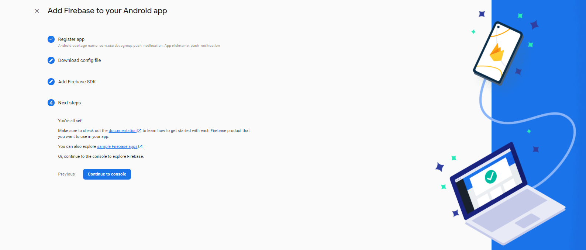

## Configuration de Firebase Messaging

Je crée un fichier pour la configuration de Firebase messaging **config_messaging.dart**

`import 'package:firebase_core/firebase_core.dart';

import 'package:firebase_messaging/firebase_messaging.dart';

import 'package:flutter_local_notifications/flutter_local_notifications.dart';


const AndroidNotificationChannel chanel = AndroidNotificationChannel(

  'hih_importance_chanel', //id

  'High Importance Notifications', //titre

  description: 'Ce canal est utilisé pour la notification d'importance',

  importance: Importance.high,

  playSound: true);


final FlutterLocalNotificationsPlugin flNotPlugin =

  FlutterLocalNotificationsPlugin();


```
Future<void> firebaseMessagingBackgroundHandler(RemoteMessage message) async {

 await Firebase.initializeApp();

 print("A background message just showed up : ${message.messageId}");

}`
```

## Configuration de Main

### Les import dans main

```
import 'package:flutter/material.dart';

import 'package:firebase_messaging/firebase_messaging.dart';

import 'package:flutter_local_notifications/flutter_local_notifications.dart';

import 'package:firebase_core/firebase_core.dart';

import 'package:push_notification/config_messaging.dart';
```

J'initialise Firebase messaging dans la fonction **main()**:

```
WidgetsFlutterBinding.ensureInitialized();
  await Firebase.initializeApp();
  FirebaseMessaging _firebaseMessaging = FirebaseMessaging.instance;

  _firebaseMessaging.getToken().then((token) {
    print('LABY DAMARO CAMARA');
    `print(token);
  });
  //Notification
  FirebaseMessaging.onBackgroundMessage(firebaseMessagingBackgroundHandler);

  await flNotPlugin
      .resolvePlatformSpecificImplementation<
          `AndroidFlutterLocalNotificationsPlugin>()!
      .createNotificationChannel(chanel);

  await FirebaseMessaging.instance.setForegroundNotificationPresentationOptions(
      `alert: true, badge: true, sound: true);
  runApp(const MyApp());
}
```

## Configuration de _MyHomePageState

Dans la fonction **initState()**

```
`FirebaseMessaging.onMessage.listen((RemoteMessage message) {`

   `try {`

    `RemoteNotification? notification = message.notification;`

    `AndroidNotification? android = message.notification!.android;`

    `if (notification != null && android != null) {`

     `flNotPlugin.show(`

       `notification.hashCode,`

       `notification.title,`

       `notification.body,`

       `NotificationDetails(`

         `android: AndroidNotificationDetails(chanel.id, chanel.name,`

           `channelDescription: chanel.description,`

           `importance: Importance.high,`

           `color: Colors.blue,`

           `playSound: true,`

           `icon: '@mipmap/ic_launcher')));`

    `}`

   `} on Exception catch (e) {}`

  `});`

  `FirebaseMessaging.onMessageOpenedApp.listen((RemoteMessage message) {`

   `RemoteNotification? notification = message.notification;`

   `AndroidNotification? android = message.notification!.android;`

   `if (notification != null && android != null) {`

    `showAboutDialog(`

      `context: context,`

      `applicationName: notification.title,`

      `applicationIcon: Icon(Icons.notification_add),`

      `children: [`

       `SingleChildScrollView(`

        `child: Column(`

         `crossAxisAlignment: CrossAxisAlignment.start,`

         `children: [Text('${notification.body}')],`

        `),`

       `)`

      `]);`

   `}`

  `});`


```

## La notification Locale

Pour cela, je vais créer une **_showNotification()** pour pouvoir la lier au floating button d'en bas

```
void _showNotification() {`

  `setState(() {`

   `_counter++;`

  `});`

  `flNotPlugin.show(`

    `0,`

    `'Teste de $_counter',`

    `'Comment allez-vous ?',`

    `NotificationDetails(`

      `android: AndroidNotificationDetails(chanel.id, chanel.name,`

        `channelDescription: chanel.description,`

        `importance: Importance.high,`

        `color: Colors.blue,`

        `playSound: true,`

        `icon: '@mipmap/ic_launcher')));`

 `}
```


